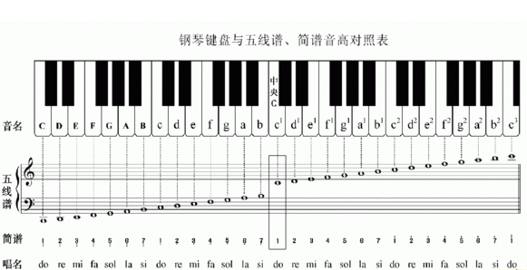
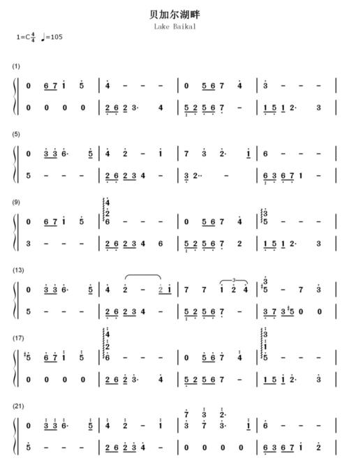
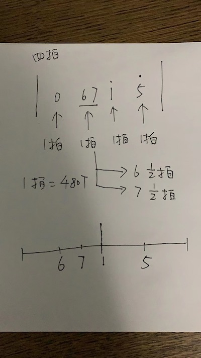
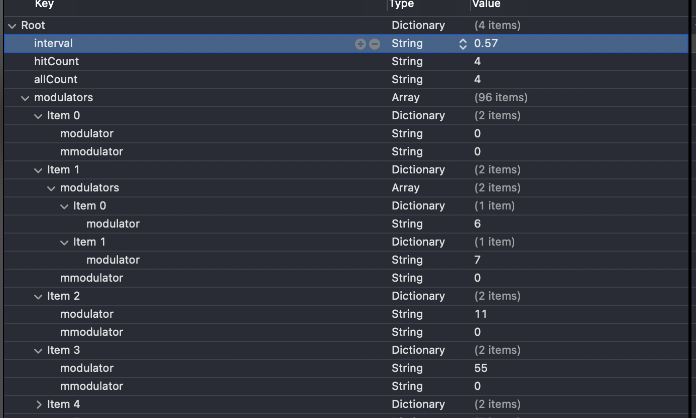

### HDMIDIPlayer


> 这是一个可以让iOS小白用户，直接根据钢琴或者其他乐器的简谱，直接开发一个可以播放的简单教程，底层使用CoreMIDI.framework来实现，中层使用开源的MIKMIDI库来实现，上层将简谱设计成合理的数据结构，将简谱数据进行对象化管理，业务方简单调用进而直接上手使用。


### 一、理论篇

#### **1、认识钢琴键盘和简谱的关系**




#### **2、认识简谱和MIDI键的关系**

其中：**中央C（1/do）** 对应的是 MIDI的 60，依次左右推算得到

| 音名  | 简谱 | MIDI值 | 和上个MIDI差值 |
| ----- | ---- | ------ | -------------- |
| 中央C | 1    | 60     | 2              |
| d1    | 2    | 62     | 2              |
| e1    | 3    | 64     | 2              |
| f1    | 4    | 65     | 1              |
| g1    | 5    | 67     | 2              |
| a1    | 6    | 69     | 2              |
| b1    | 7    | 71     | 2              |
| c2    | 1+   | 72     | 1              |
| ...   | ...  | ...    | ...            |

规律点就是 3 - 4 MIDI 差值为1，7 - 1的MIDI差值为1，其他都是2。这个正是和钢琴按键对应上。

这里整理了较为完整的 唱名对应的MIDI值的枚举关系：

```objc
typedef NS_ENUM(NSInteger, HDModulatorMidiValue) {
    HDModulatorMidiEmpty = -1000,   // 空一拍
    
    HDModulatorMidiLowLowDo = -24,
    HDModulatorMidiLowLowRe = -22,
    HDModulatorMidiLowLowMi = -20,
    HDModulatorMidiLowLowFa = -19,
    HDModulatorMidiLowLowSol = -17,
    HDModulatorMidiLowLowLa = -15,
    HDModulatorMidiLowLowSi = -13,
    
    HDModulatorMidiLowDo = -12,
    HDModulatorMidiLowRe = -10,
    HDModulatorMidiLowMi = -8,
    HDModulatorMidiLowFa = -7,
    HDModulatorMidiLowSol = -5,
    HDModulatorMidiLowLa = -3,
    HDModulatorMidiLowSi = -1,
    
    HDModulatorMidiDo = 0,
    HDModulatorMidiRe = 2,
    HDModulatorMidiMi = 4,
    HDModulatorMidiFa = 5,
    HDModulatorMidiSol = 7,
    HDModulatorMidiLa = 9,
    HDModulatorMidiSi = 11,
    
    HDModulatorMidiHighDo = 12,
    HDModulatorMidiHighRe = 14,
    HDModulatorMidiHighMi = 16,
    HDModulatorMidiHighFa = 17,
    HDModulatorMidiHighSol = 19,
    HDModulatorMidiHighLa = 21,
    HDModulatorMidiHighSi = 23,
    
    HDModulatorMidiHighHighDo = 24,
    HDModulatorMidiHighHighRe = 26,
    HDModulatorMidiHighHighMi = 28,
    HDModulatorMidiHighHighFa = 29,
    HDModulatorMidiHighHighSol = 31,
    HDModulatorMidiHighHighLa = 33,
    HDModulatorMidiHighHighSi = 35,
};
```

使用方式（播放 “do、re、mi”）

```objc
UInt8 note = 60 + HDModulatorMidiDo;
MIKMIDINoteOnCommand *noteOn = [MIKMIDINoteOnCommand noteOnCommandWithNote:note velocity:127 channel:1 timestamp:[NSDate date]];
[self.synthesizer handleMIDIMessages:@[noteOn]];

note = 60 + HDModulatorMidiRe;
noteOn = [MIKMIDINoteOnCommand noteOnCommandWithNote:note velocity:127 channel:1 timestamp:[NSDate date]];
[self.synthesizer handleMIDIMessages:@[noteOn]];

note = 60 + HDModulatorMidiMi;
noteOn = [MIKMIDINoteOnCommand noteOnCommandWithNote:note velocity:127 channel:1 timestamp:[NSDate date]];
[self.synthesizer handleMIDIMessages:@[noteOn]];
```


#### **3、钢琴简谱如何生成对应MIDI值**

 

首先看一下该简谱的基本信息：

```
C4/4：表示C调，4/4拍，即 “da da da da”
♩：四分音符（全音符时值的四分之一拍）
105：表示一分钟有105拍，也就是60/107=0.57秒为一拍

0 67 1` 5`	：该行为主旋律，其中 0 是空拍；67 为一拍；1` 是do的高音
0 0  0  0		：该行为副旋律或者伴奏，表示四个空拍
```



所以这四拍对应的**数据结构**应该是



字段解析如下：

```sh
interval：表示一拍的时间间隔
hitCount/allCount：4/4拍
modulators：
	modulator：钢琴简谱的值（主旋律）。1-7直接输入1-7；“1`-7`”高音输入“11-77”； “1.-7.”低音输入为 “-1  -7”
	mmodulator：钢琴简谱的值（主旋律）
	
# 如果一拍又有多个拍子，则需要将该拍的多个小拍子添加再 modulators/mmodulators 中
modulators = ({
	modulators = ({
		modulator = 6;	
		}, {
		modulator = 7;
	});
	mmodulators = ({
		mmodulator = "-2";
		}, {
		mmodulator = "-6";
	});
})
```

原生代码对象如下：

```objc
/// 节拍数据对象
@interface HDModulatorItem : NSObject
  
/// 节拍的间隔时间
@property (nonatomic, assign) NSTimeInterval interval;

/// 节拍应该的拍数
@property (nonatomic, assign) NSUInteger hitCount;

/// 节拍的总拍数，和 beatHitCount 可以组合成 3/4、6/8 等节拍
@property (nonatomic, assign) NSUInteger allCount;

/// 钢琴曲中的音阶（主旋律）和 modulators 互斥
@property (nonatomic, assign) NSInteger modulator;

/// 钢琴曲中的音阶（副旋律/伴奏）和 minorModulators 互斥
@property (nonatomic, assign) NSInteger minorModulator;

/// 钢琴曲中的音阶（该拍子中又包含多个音阶） （主旋律）
@property (nonatomic, copy) NSArray <HDModulatorItem *>*modulators;

/// 钢琴曲中的音阶（该拍子中又包含多个音阶）（副旋律/伴奏）
@property (nonatomic, copy) NSArray <HDModulatorItem *>*minorModulators;

/// MIDI的音阶（主旋律）
@property (nonatomic, assign) HDModulatorMidiValue midiModulator;

/// MIDI的音阶（副旋律/伴奏）
@property (nonatomic, assign) HDModulatorMidiValue midiMinorModulator;

@end
```


### 二、实践篇

#### 1、根据钢琴简谱生存MIDI数据库

这里没有好的方案，只能根据简谱及上面的理论知识，一个个将MIDI数据输入到PLIST文件中，当然比较高级的做法应该可以通过拍照来自动生成。技术难度应该有，容错机制等细节问题需要具体场景去实现解决。


#### 2、MIDI数据转成原生对象

基于已经设计的数据结构，生成钢琴简谱的原生对象

```objc
/// 一首曲子的节拍及音阶信息
@interface HDModulator : NSObject

/// 节拍的间隔时间
@property (nonatomic, assign) NSTimeInterval beatInterval;

/// 节拍应该的拍数
@property (nonatomic, assign) NSUInteger beatHitCount;

/// 节拍的总拍数，和 beatHitCount 可以组合成 3/4、6/8 等节拍
@property (nonatomic, assign) NSUInteger beatAllCount;

/// 音阶组合（数据结构是树形结构，对应的是plist的数据结构）
@property (nonatomic, copy) NSArray <HDModulatorItem *>*beatModulators;

/// 音阶组合（数据结构是队列结构）（主旋律）
@property (nonatomic, copy) NSMutableArray <HDModulatorItem *>*combineModulators;

/// 音阶组合（数据结构是队列结构）（副旋律/伴奏）
@property (nonatomic, copy) NSMutableArray <HDModulatorItem *>*combineMinorModulators;
```


通过MJExtension来转换

```objc
+ (instancetype)loadPlist:(NSString *)plist {
    NSString *filePath = [NSBundle.mainBundle pathForResource:plist ofType:@"plist"];
    HDModulator *model = [HDModulator mj_objectWithFile:filePath];
    return model;
}
```


#### 3、对象数据处理

上面一部分将数据库转成了原生模型，但是每一拍的结构是树形结构，这里需要将其打平成一个数组，并且需要留言每个拍子中多个小拍的时间

```objc
/// 音阶组合（数据结构是队列结构）（主旋律）
- (NSMutableArray <HDModulatorItem *>*)combineModulators {
    if (!_combineModulators) {
        _combineModulators = [NSMutableArray array];
        for (HDModulatorItem *item in self.beatModulators) {
            item.interval = self.beatInterval;
            [self addModulatorItem:item];
        }
    }
    return _combineModulators;
}

- (void)addModulatorItem:(HDModulatorItem *)item {
    if (item.modulators.count > 0) {
    		// 这里需要注意，一拍中又包含多个小拍，时间间隔需要处理
        NSTimeInterval beatInterval = item.interval / item.modulators.count;
        for (HDModulatorItem *mm in item.modulators) {
            mm.interval = beatInterval;
            [self addModulatorItem:mm];
        }
    }
    else {
        [_combineModulators addObject:item];
    }
}

/// 音阶组合（数据结构是队列结构）（副旋律/伴奏）
- (NSMutableArray <HDModulatorItem *>*)combineMinorModulators {
    if (!_combineMinorModulators) {
        _combineMinorModulators = [NSMutableArray array];
        for (HDModulatorItem *item in self.beatModulators) {
            item.interval = self.beatInterval;
            [self addMinorModulatorItem:item];
        }
    }
    return _combineMinorModulators;
}

- (void)addMinorModulatorItem:(HDModulatorItem *)item {
    if (item.minorModulators.count > 0) {
        // 这里需要注意，一拍中又包含多个小拍，时间间隔需要处理
        NSTimeInterval beatInterval = item.interval / item.minorModulators.count;
        for (HDModulatorItem *mm in item.minorModulators) {
            mm.interval = beatInterval;
            [self addMinorModulatorItem:mm];
        }
    }
    else {
        [_combineMinorModulators addObject:item];
    }
}
```

#### 4、数据播放

这里直接是调用已经封装好的MIDI播放器进行播放即可

```objc
_modulator = [HDModulator loadPlist:@"bjehp"];

- (void)playIndex:(NSInteger)index {
    if (!_isPlay) {
        return;
    }
    if (_modulator.combineModulators.count <= index) {
        return;
    }
    
    HDModulatorItem *item = _modulator.combineModulators[index];
    NSInteger midiModulator = item.midiModulator;
    NSLog(@"七音阶（主）：%ld MIDI音阶：%ld 下一拍时间间隔：%0.2f", item.modulator, midiModulator, item.interval);
    if (midiModulator != -1000) {
        UInt8 note = 60 + midiModulator;
        MIKMIDINoteOnCommand *noteOn = [MIKMIDINoteOnCommand noteOnCommandWithNote:note velocity:127 channel:0 timestamp:[NSDate date]];
        [self.synthesizer handleMIDIMessages:@[noteOn]];
    }

    dispatch_after(dispatch_time(DISPATCH_TIME_NOW, (int64_t)(item.interval * NSEC_PER_SEC)), dispatch_get_main_queue(), ^{
        [self playIndex:index+1];
    });
}

- (void)playMinorIndex:(NSInteger)index {
    if (!_isPlay) {
        return;
    }
    
    if (_modulator.combineMinorModulators.count <= index) {
        return;
    }
    
    HDModulatorItem *item = _modulator.combineMinorModulators[index];
    NSInteger midiMinorModulator = item.midiMinorModulator;
    NSLog(@"七音阶（副）：%ld MIDI音阶：%ld 下一拍时间间隔：%0.2f", item.minorModulator, midiMinorModulator, item.interval);
    if (midiMinorModulator != -1000) {
        UInt8 note = 60 + midiMinorModulator;
        MIKMIDINoteOnCommand *noteOn = [MIKMIDINoteOnCommand noteOnCommandWithNote:note velocity:127 channel:1 timestamp:[NSDate date]];
        [self.synthesizer handleMIDIMessages:@[noteOn]];
    }

    dispatch_after(dispatch_time(DISPATCH_TIME_NOW, (int64_t)(item.interval * NSEC_PER_SEC)), dispatch_get_main_queue(), ^{
        [self playMinorIndex:index+1];
    });
}
```

播放过程中的日志信息如下：

```sh
2022-03-16 17:43:39.241376+0800 七音阶（主）：0 MIDI音阶：-1000 下一拍时间间隔：0.60
2022-03-16 17:43:39.241565+0800 七音阶（副）：0 MIDI音阶：-1000 下一拍时间间隔：0.60
2022-03-16 17:43:39.896846+0800 七音阶（主）：6 MIDI音阶：9 下一拍时间间隔：0.30
2022-03-16 17:43:39.897053+0800 七音阶（副）：0 MIDI音阶：-1000 下一拍时间间隔：0.60
2022-03-16 17:43:40.224594+0800 七音阶（主）：7 MIDI音阶：11 下一拍时间间隔：0.30
2022-03-16 17:43:40.545589+0800 七音阶（副）：0 MIDI音阶：-1000 下一拍时间间隔：0.60
2022-03-16 17:43:40.545754+0800 七音阶（主）：11 MIDI音阶：12 下一拍时间间隔：0.60
2022-03-16 17:43:41.195015+0800 七音阶（副）：0 MIDI音阶：-1000 下一拍时间间隔：0.60
2022-03-16 17:43:41.195196+0800 七音阶（主）：55 MIDI音阶：19 下一拍时间间隔：0.60
2022-03-16 17:43:41.845323+0800 七音阶（副）：-2 MIDI音阶：-10 下一拍时间间隔：0.30
2022-03-16 17:43:41.845505+0800 七音阶（主）：44 MIDI音阶：17 下一拍时间间隔：0.60
2022-03-16 17:43:42.170909+0800 七音阶（副）：-6 MIDI音阶：-3 下一拍时间间隔：0.30
2022-03-16 17:43:42.495522+0800 七音阶（主）：0 MIDI音阶：-1000 下一拍时间间隔：0.60
2022-03-16 17:43:42.495700+0800 七音阶（副）：2 MIDI音阶：2 下一拍时间间隔：0.60
2022-03-16 17:43:43.145171+0800 七音阶（主）：0 MIDI音阶：-1000 下一拍时间间隔：0.60
2022-03-16 17:43:43.145845+0800 七音阶（副）：3 MIDI音阶：4 下一拍时间间隔：0.60
2022-03-16 17:43:43.795268+0800 七音阶（主）：0 MIDI音阶：-1000 下一拍时间间隔：0.60
```

看看效果如何？

<video id="video" controls=""src="./Sources/bjehp.mov" preload="none">

以上的所有功能均已经开源 [开源地址](https://github.com/erduoniba/HDMIDIPlayer/tree/master)

### 三、参考资料

[MIDI播放库](https://github.com/mixedinkey-opensource/MIKMIDI)

[数据转模型库](https://github.com/CoderMJLee/MJRefresh)

[Typora插入视频](https://blog.csdn.net/weixin_44586845/article/details/115586168)

